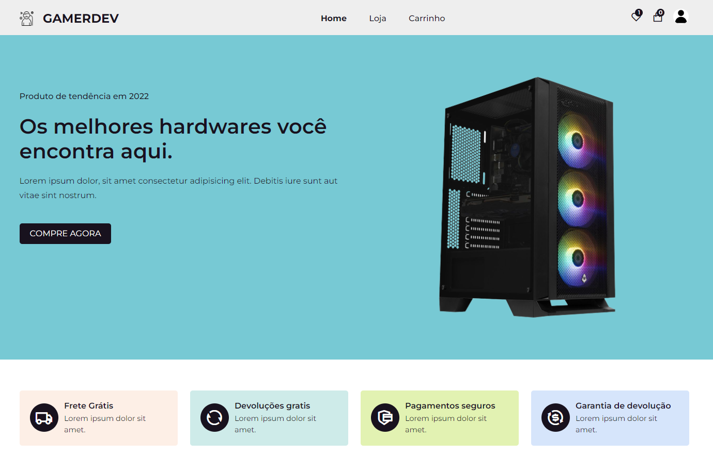

# GAMERDEV

## Projeto usando React, Firebase e Redux Tolkit

## Link: https://douglasmonteirodev.github.io/builds/gamerdev/

 

      

## Objetivo

### Foi criar um e commerce moderno usando redux tolkit para gereciamento de estados e firebase para autenticação.

## Descrição

- `Área de login`
- `Área para criação de novos usários`
- `Vários produtos do universo gamer`
- `Opção de categorias`
- `Opção de pesquisa por nome do produto`
- `Carrinho de compras moderno`

# Douglas Monteiro ❤😎
